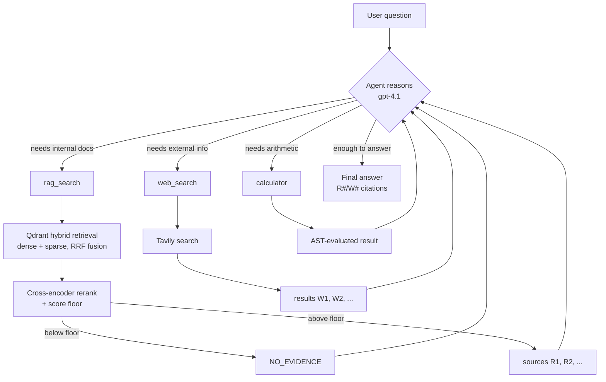

# agentic-rag

A multi-step, tool-using RAG agent — built on top of [rag-multimodal](https://github.com/rshaik99/rag-multimodal)'s
retrieval stack, but restructured around an LLM that *decides* what to do
next rather than a fixed retrieve-then-answer pipeline.

## What's actually "agentic" here

rag-multimodal's pipelines are one-shot: retrieve → rerank → generate, same
steps every query. This project wires the same hybrid-retrieval + rerank +
score-floor discipline into a **tool** the LLM can choose to call, alongside
a calculator and live web search, inside a ReAct loop (reason → pick a tool
→ observe the result → repeat → answer). The model decides which tools to
call, in what order, how many times — based on the question, not on
hardcoded branching.



Every tool result loops back into the agent's reasoning step — it's not a
fixed sequence. A question needing figures **and** a derived percentage
**and** an external comparison chains `rag_search` → `calculator` →
`web_search` in one turn, purely because the LLM decided each step was
needed after seeing the previous result (verified in testing, not just
theoretical).

## Tools

| Tool | What it does | Guardrail |
|---|---|---|
| `rag_search` | Hybrid (dense+sparse) retrieval over an internal document corpus, reranked, score-floored | Below the relevance floor, returns `NO_EVIDENCE` explicitly rather than a weak match -- the system prompt forbids falling back to the model's own knowledge when this happens |
| `web_search` | Live web search via Tavily | Kept as a distinct tool (not a rag_search fallback) so which questions needed external info vs. the internal corpus is visible in the trace |
| `calculator` | Arithmetic on numbers the agent already has | AST-walked, not `eval()` -- LLM tool-call arguments are untrusted input |

Citations are prefixed by source (`[R1]`, `[R2]`... from `rag_search`;
`[W1]`, `[W2]`... from `web_search`) so internal-vs-external sourcing is
unambiguous by construction, not just by the model's prose.

## Multi-turn memory

No separate "condense the follow-up into a standalone query" step. The
agent's full message history -- including past tool calls and their results
-- is carried into the next turn, so a follow-up like "what about just Q3 to
Q4?" can be answered from context already in that history without
re-retrieving.

## Quickstart

```bash
git clone https://github.com/rshaik99/agentic-rag.git
cd agentic-rag
python -m venv .venv && .venv\Scripts\activate      # Windows
pip install -r requirements.txt

cp .env.example .env
# set OPENAI_API_KEY (required) and TAVILY_API_KEY (required for web_search,
# free tier at tavily.com)

# needs an indexed Qdrant collection to query -- see "Relationship to
# rag-multimodal" below
python -m agentic_rag.agent "What caused incident ERR-4417 and how was it fixed?"
python -m agentic_rag.cli    # multi-turn chat
```

## Relationship to rag-multimodal

This currently points at the **same local Qdrant instance and collection**
(`rag_lab_lc`) that [rag-multimodal](https://github.com/rshaik99/rag-multimodal)
indexes, rather than shipping its own ingestion pipeline. To get a working
corpus:

1. Clone and set up rag-multimodal
2. Run its `docker compose up -d` (Qdrant) and `python -m langchain_pipeline.run_all --recreate`
3. Point this project's `.env` `QDRANT_URL`/`QDRANT_COLLECTION` at that same instance

This is a known coupling, not a design goal -- an eventual improvement is
giving this project its own ingestion path so it doesn't silently depend on
a sibling repo's local state.

## Known gaps

- **Citation counts aren't verified against what a tool actually returned.**
  Seen once: an answer cited `[R2]` when `rag_search` only returned `[R1]`.
  rag-multimodal's `step_d` modules solve this with programmatic citation
  checking (regex-extract cited numbers, verify each exists in the actual
  retrieved set) -- worth porting here.
- No structured-data/SQL tool yet (deferred).
- No automated tests -- verification so far has been manual, traced runs
  (see the `[tool call]` / `[tool result]` trace lines each run prints).

## License

MIT -- see [LICENSE](LICENSE).
